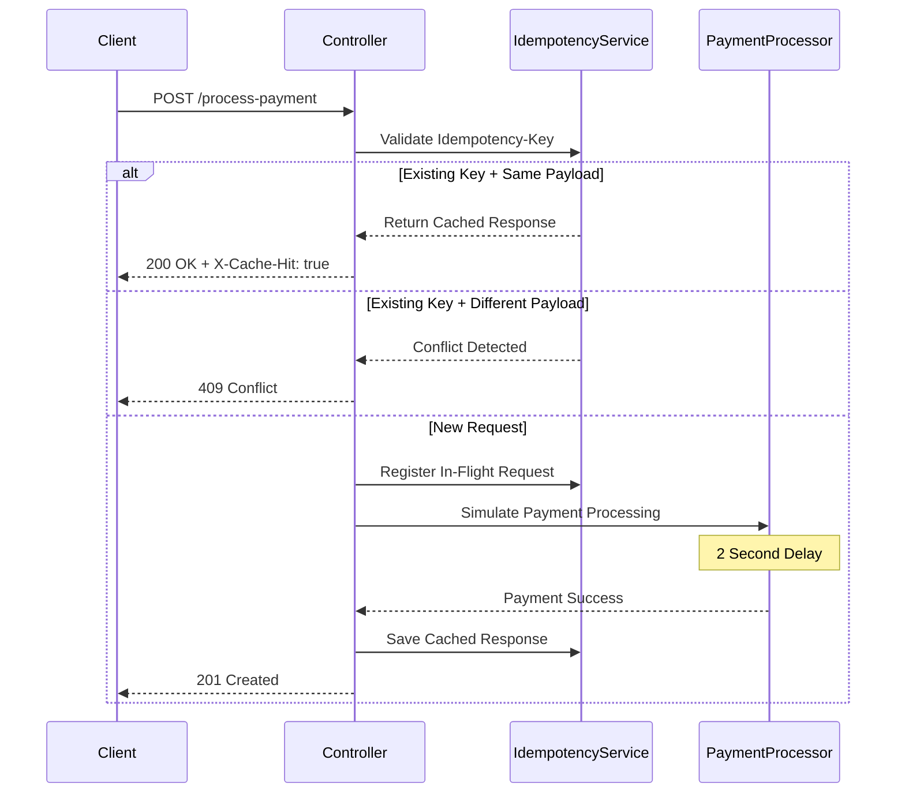

# IgirePay Idempotency Payment Gateway

A production-ready Idempotency Layer built with Java and Spring Boot that guarantees payment requests are processed exactly once, even when clients retry requests due to network failures or timeouts.

This project simulates a fintech payment processing backend and prevents duplicate transactions through idempotency protection, concurrency control, and payload validation.

---

# Features

- Strict idempotency enforcement using `Idempotency-Key`
- Duplicate request replay without reprocessing
- SHA-256 request body hashing for payload integrity
- Concurrent request protection using `ConcurrentHashMap`
- In-flight request handling using `CompletableFuture`
- Automatic TTL cleanup for expired idempotency keys
- Request validation using JSR-303 Bean Validation
- Production-style layered architecture
- Global exception handling
- Thread-safe processing

---

# Architecture Diagram



---

# Project Structure

```text
src/main/java/com/igirepay

├── controller
├── dto
├── exception
├── model
├── service
├── store
├── util
└── config
```

---

# Technologies Used

- Java 17
- Spring Boot
- Maven
- ConcurrentHashMap
- CompletableFuture
- Bean Validation
- SHA-256 Hashing

---

# Setup Instructions

## Prerequisites

Make sure the following tools are installed:

- Java 17 or higher
- Maven
- Git

---

# Clone Repository

```bash
git clone https://github.com/Aline-CROIRE/SheCanCode-associate-Assessment-.git
cd SheCanCode-associate-Assessment-
```

---

# Run Application

## Linux / macOS

```bash
./mvnw spring-boot:run
```

## Windows

```bash
mvnw.cmd spring-boot:run
```

The server will start on:

```text
http://localhost:8080
```

---

# API Documentation

# Process Payment

## Endpoint

```http
POST /process-payment
```

---

## Headers

```http
Idempotency-Key: unique-request-key
Content-Type: application/json
```

---

## Request Body

```json
{
  "amount": 100.0,
  "currency": "RWF"
}
```

---

# Successful First Request

## Response

```http
201 Created
```

```json
{
  "message": "Charged 100.0 RWF"
}
```

---

# Duplicate Request With Same Payload

If the same request is sent again using the same `Idempotency-Key` and identical payload:

## Response

```http
201 Created
X-Cache-Hit: true
```

```json
{
  "message": "Charged 100.0 RWF"
}
```

The payment is not processed again.

---

# Duplicate Request With Different Payload

If the same `Idempotency-Key` is reused with a different request body:

## Response

```http
409 Conflict
```

```json
{
  "error": "Idempotency key already used for a different request body."
}
```

---

# Example cURL Requests

## First Request

```bash
curl -X POST http://localhost:8080/process-payment \
-H "Content-Type: application/json" \
-H "Idempotency-Key: payment-123" \
-d '{"amount":100.0,"currency":"RWF"}'
```

---

## Replay Request

```bash
curl -X POST http://localhost:8080/process-payment \
-H "Content-Type: application/json" \
-H "Idempotency-Key: payment-123" \
-d '{"amount":100.0,"currency":"RWF"}'
```

---

## Conflict Request

```bash
curl -X POST http://localhost:8080/process-payment \
-H "Content-Type: application/json" \
-H "Idempotency-Key: payment-123" \
-d '{"amount":500.0,"currency":"RWF"}'
```

---

# Concurrency Handling

This project safely handles concurrent requests using:

- `ConcurrentHashMap`
- `CompletableFuture`

If two identical requests arrive simultaneously:

- Only one request processes the payment
- The second request waits for the first request to complete
- Both requests receive the exact same response
- Double charging is prevented

---

# Developer's Choice Feature

# Input Validation

This project includes request validation using JSR-303 Bean Validation.

## Why This Feature Was Added

In real fintech systems, invalid payment data can cause:

- Financial inconsistencies
- Database corruption
- Fraud risks
- Failed settlements

To prevent this, the system validates all incoming requests before processing.

---

# Validation Rules

- Amount must be greater than zero
- Currency must not be empty
- Invalid requests are rejected immediately

---

# TTL Expiration System

The system automatically removes expired idempotency records after 10 minutes.

## Benefits

- Prevents memory leaks
- Reduces replay attack risks
- Improves long-term system performance
- Mimics real-world payment gateway behavior

A scheduled cleanup task runs every 60 seconds.

---

# Technical Design Decisions

## ConcurrentHashMap

Used for fast in-memory storage with thread-safe access.

## CompletableFuture

Used to coordinate concurrent in-flight requests safely.

## SHA-256 Hashing

Used to verify request body integrity and detect payload tampering.

## Scheduled Cleanup

Used to automatically remove expired idempotency records.

---

# Testing Scenarios

The application supports the following scenarios:

- First successful payment request
- Duplicate request replay
- Conflict detection for modified payloads
- Concurrent identical requests
- Validation failure handling
- Expired key cleanup

---

# Git Commit Strategy

The project was developed using small, meaningful commits to maintain clean version history and demonstrate proper Git workflow.

Example commit messages:

```text
Initialize Spring Boot project
Add payment request DTO
Implement payment processing endpoint
Add idempotency key validation
Implement cached response replay
Handle concurrent request protection
Add TTL expiration cleanup
Implement global exception handling
Create README documentation
```

---

# Future Improvements

Possible production-level improvements include:

- Redis-backed distributed storage
- PostgreSQL persistence
- Distributed locking
- OpenAPI / Swagger documentation
- Docker containerization
- Rate limiting
- Authentication and authorization
- Metrics and monitoring

---

# Author

Aline NIYONIZERA

Backend Engineering Assessment Submission